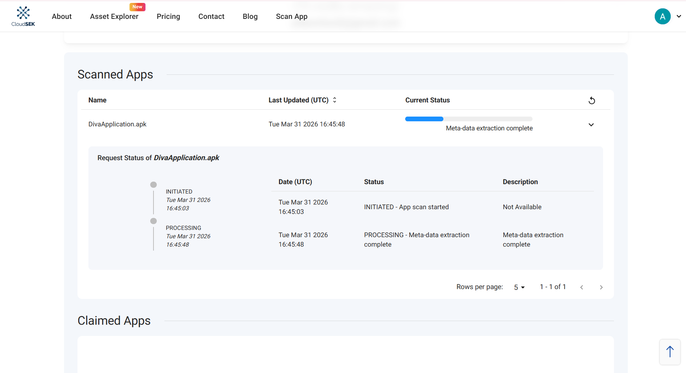
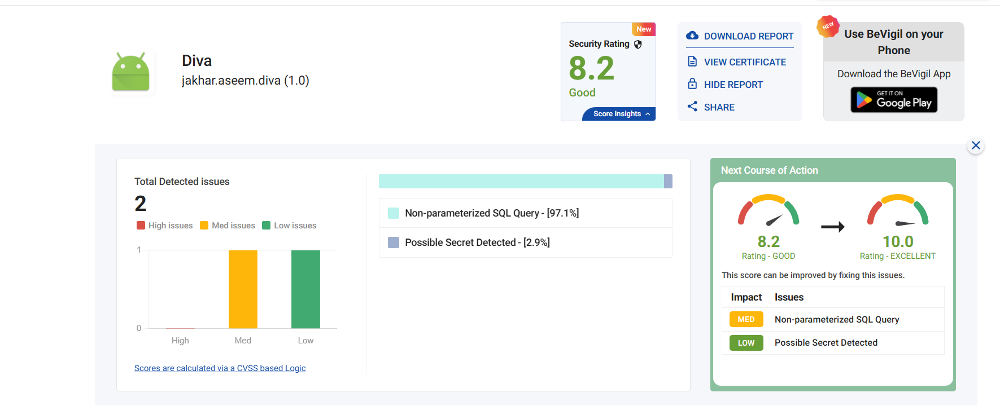
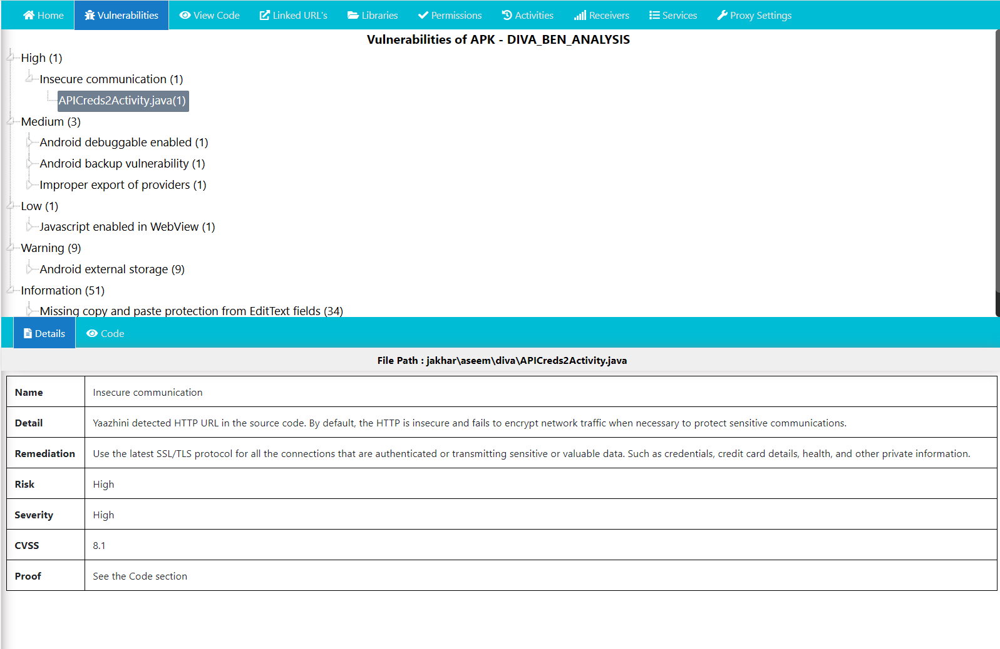

# Audit de Securite Mobile : Projet DIVA
**Analyste :** Ali Benrioui (BEN)
**Date :** Mars 2026
**Cible :** Damn Insecure and Vulnerable App (DIVA) - Android

---

## Presentation du Projet
Ce depot contient les resultats d'un audit de securite statique et d'une analyse d'exposition cloud effectues sur l'application pedagogique DIVA. L'objectif est d'identifier les vulnerabilites critiques liees au stockage de donnees, aux communications reseau et aux configurations systeme selon le standard OWASP MASVS.

---

## Methodologie et Outils
L'audit a ete mene en suivant une approche structuree de tracabilite :
1. Reconnaissance Passive (OSINT) : Utilisation de BeVigil pour l'exposition cloud.
2. Analyse Statique (SAST) : Utilisation de Yaazhini pour l'inspection du code source et du manifeste.
3. Triage et Correlation : Consolidation des resultats et mapping avec le referentiel OWASP.

---

## Etape 1 : Analyse d'Exposition (BeVigil)
L'analyse a debute par un scan cloud pour identifier les fuites d'assets et les secrets exposes sans meme decompiler l'APK.

**Preuves de scan :**

**Points cles identifies :**
- Detection d'URLs non securisees (HTTP).
- Presence potentielle de secrets codes en dur.

---

## Etape 2 : Analyse Statique approfondie (Yaazhini)
Le scan local a permis de confirmer les doutes leves lors de la phase OSINT et d'identifier des failles critiques dans le code Java.

**Top des Vulnerabilites Confirmees :**
1. Insecure Communication (High - CVSS 8.1) : Transmission de donnees sensibles en clair.
2. Android Debuggable Enabled (Medium) : Facilite l'exploitation dynamique.
3. AllowBackup Enabled (Medium) : Risque d'extraction de donnees locales via ADB.

---

## Synthese et Triage (OWASP Mapping)
Les constats ont ete normalises dans un fichier de triage et lies aux exigences MASVS.

- Rapport de Triage : Consulter le fichier 03-[BEN]-triage/triage_BEN.csv
- Mapping OWASP : Consulter le fichier 03-[BEN]-triage/owasp_mapping_BEN.md

---

## Structure du Repository
- 00-[BEN]-perimetre-ethique/ : APK source et perimetre d'audit
- 01-[BEN]-bevigil/           : Preuves d'exposition cloud
- 02-[BEN]-yaazhini/          : Rapports d'analyse statique du code
- 03-[BEN]-triage/            : Consolidation et Mapping OWASP
- 04-[BEN]-report/            : Rapport final d'audit

---

## Recommandations Prioritaires
1. Migration vers HTTPS pour toutes les API Creds.
2. Desactivation du mode Debug et du flag Backup dans le Manifest.
3. Utilisation de l'Android Keystore pour le stockage des secrets.